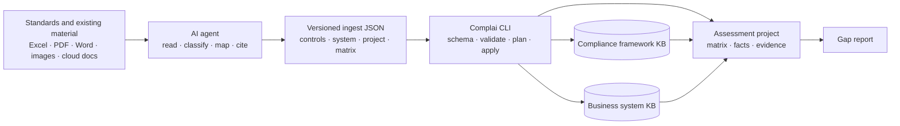

<div align="center" id="top">

# Complai

### Compliance engineering for AI agents

*Turn standards, system documentation, assessment records, and evidence into a
traceable compliance knowledge base, control matrix, and gap report.*

English | [简体中文](README.md)

[](https://crates.io/crates/complai)
[](LICENSE)
[](https://www.rust-lang.org/)
[](https://github.com/adeptify/complai/commits/main)

[Quickstart](#quickstart-guide) · [How it works](#how-it-works) ·
[Capabilities](#capabilities) · [Documentation](#documentation)

</div>

---

## What is Complai?

Complai is an open-source Rust CLI and Agent Skill for compliance preparation,
gap analysis, and evidence management. It helps AI agents turn information
scattered across standards, regulatory filings, assessment reports, Excel
workbooks, PDFs, cloud documents, and screenshots into reusable, validated,
and traceable compliance context.

Complai is not another chat interface and does not bundle an LLM. You continue
using your existing agent to read and understand source material; Complai
provides stable data models, strict write boundaries, provenance tracking, and
deterministic file operations.

The core model stays simple:

```text
one project = one system × one compliance framework × one assessment scope
```

System facts such as architecture, assets, and data flows can be reused across
projects. Framework controls can be reused across systems. Findings, matrix
decisions, evidence, and reports for a particular assessment stay within that
project.

## The compliance loop: model · ingest · assess · deliver

- **Model:** Initialize the compliance framework, business system, and complete
  control matrix.
- **Ingest:** Let an agent read any accessible Excel, PDF, Word, image, Feishu,
  or Tencent document and produce a versioned JSON bundle.
- **Assess:** Compare control requirements with system facts and evidence,
  record `met`, `partial`, `gap`, or `na`, and capture gaps, owners, and
  remediation details.
- **Deliver:** Trace every decision back to its source, register evidence, and
  generate a reviewable compliance gap report.

## Why Complai?

- **Agent-native:** Workflows ship with the CLI and load on demand, keeping
  instructions aligned with the installed binary.
- **Format-agnostic input:** Agents and their available tools read source
  documents, so users do not need to prepare a dedicated import template.
- **Controlled writes:** Every batch write follows
  `schema → validate → plan → apply`.
- **Traceable provenance:** Records retain source type, document reference,
  page/sheet/section location, optional SHA-256, document date, confidence, and
  a stable external key.
- **Reusable system knowledge:** Architecture and asset facts do not need to be
  recreated for every framework or annual assessment.
- **Open local storage:** Knowledge and project state remain in inspectable,
  portable local files rather than being hidden in prompts or a closed
  platform.

## How it works



The agent selects the best available reader for each source. Complai accepts
only records that conform to the current JSON Schema and reference valid target
systems, projects, frameworks, and controls.

## Quickstart Guide

Complai is agent-driven: install the CLI, install the lightweight discovery
skill, then describe the compliance task you want to complete.

### 1. Install the CLI

Stable Rust and Cargo are required. The current feature baseline is Complai
`0.4.0`:

```sh
cargo install complai --version 0.4.0 --locked
complai --version
```

To use an unreleased repository version:

```sh
cargo install --git https://github.com/adeptify/complai --locked --force
complai --version
```

### 2. Install the discovery skill

The CLI and Agent Skill are distributed separately. Node.js/npm is needed only
to install the skill:

```sh
npx skills add adeptify/complai --skill complai
```

This installs a lightweight entry point. The actual workflows ship with the
CLI and load on demand:

```sh
complai skill list
complai skill get project-init
```

### 3. Ask your agent to initialize an assessment project

Open your agent in the directory where you want to create the project, then
say:

> Use Complai to create a Level 3 MLPS 2.0 assessment for the Order Platform.
> Use `order-platform` as the system slug and
> `order-platform-dengbao3` as the project name.

The agent loads `project-init`, confirms the system, framework, project name,
and an optional framework level, then runs:

```sh
complai compliance scaffold dengbao-2.0
complai system init order-platform --name "Order Platform"
complai project init order-platform-dengbao3 \
  --system order-platform \
  --framework dengbao-2.0 \
  --level 3
```

### 4. Provide existing material

Place local material in a directory, attach it to the agent, or provide a cloud
document link the agent is authorized to access. Then say:

> Import the standards, filing material, assessment reports, asset inventory,
> and architecture documents from `./materials` into the current Complai
> project. Show me the ingest plan before applying it.

The agent loads `doc-ingest`, uses the appropriate tools to read the material,
generates `tmp/complai-ingest.json`, and runs:

```sh
complai ingest schema
complai ingest validate --from tmp/complai-ingest.json
complai ingest plan --from tmp/complai-ingest.json
# Run only after reviewing the plan:
complai ingest apply --from tmp/complai-ingest.json
```

One bundle can contain four record types:

| Record type | Destination | Typical source |
|---|---|---|
| `control_content` | Shared compliance framework KB | Authorized standards or control guidance |
| `system_fact` | Shared business system KB | Architecture, assets, data flows, deployment material |
| `project_fact` | Current assessment project | Findings, remediation, exceptions, decisions |
| `matrix_assessment` | Current control matrix | Assessment decisions and gaps |

When importing a framework that is not in the KB yet, such as ISO, NIST,
SOC 2, or PCI DSS, include `title`, `domain`, and `category` in each
`control_content` record. Complai creates the controls and builds the index.

Low-confidence records are rejected by default. Use
`--allow-low-confidence` only after human review and confirmation.

### 5. Run gap analysis and generate a report

Continue by telling the agent:

> Assess each control. Use only imported facts and registered evidence, flag
> uncertain decisions, and generate a gap report.

The agent loads `gap-analysis` and retrieves only the context needed for each
control:

```sh
complai compliance show dengbao-2.0:8.1.4.1
complai system find --control dengbao-2.0:8.1.4.1
complai fact find --control dengbao-2.0:8.1.4.1
complai evidence find --control dengbao-2.0:8.1.4.1
complai matrix trace dengbao-2.0:8.1.4.1

complai evidence add mfa-login.png \
  --control dengbao-2.0:8.1.4.1 \
  --type screenshot
complai matrix link dengbao-2.0:8.1.4.1 --evidence EV-0001
complai matrix set dengbao-2.0:8.1.4.1 gap \
  --gap "MFA is not enabled for operations access" \
  --owner "Security Lead"

complai gen report
```

The report is written to `drafts/compliance-report.md` inside the project.

## Capabilities

| Capability | Purpose | Main commands |
|---|---|---|
| Compliance framework KB | Share control definitions, requirement summaries, and implementation guidance | `compliance scaffold/list/show/build` |
| Business system KB | Reuse architecture, asset, data-flow, and policy facts | `system init/add/find/show` |
| Unified ingest | Strict, traceable, idempotent agent batch writes | `ingest schema/validate/plan/apply` |
| Assessment projects | Bind one system, framework, and optional level | `project init/show` |
| Control matrix | Track status, gaps, owners, facts, and evidence references | `matrix show/set/link/trace` |
| Project facts | Store findings, remediation, exceptions, decisions, and notes | `fact add/find/show` |
| Evidence management | Copy, hash, classify, query, and link evidence | `evidence add/list/find/show` |
| Report generation | Generate the current compliance gap report | `gen report` |

## Built-in agent workflows

| Workflow | Use it for |
|---|---|
| `project-init` | Confirm the system, framework, and optional level, then initialize a project |
| `doc-ingest` | Read any accessible source and produce a controlled ingest bundle |
| `gap-analysis` | Assess controls, link facts and evidence, and generate a report |

Discover and load workflows through the installed CLI:

```sh
complai skill list
complai skill get doc-ingest
```

See [skills/SKILLS.md](skills/SKILLS.md) for distribution and maintenance
details.

## Storage model

Shared knowledge is stored in `~/.complai/kb` by default:

```text
~/.complai/kb/
├── compliance/<framework>/
│   ├── index.yaml
│   ├── <framework-specific-path>/<control-id>.md
│   └── controls/<safe-control-id>.md
└── system/<slug>/
    ├── index.yaml
    └── <domain>/SYS-F-NNNN.md

<project>/
├── project.yaml
├── matrix.yaml
├── facts/
├── evidence.yaml
├── evidence/
└── drafts/
```

Environment variables:

- `COMPLAI_KB_DIR`: Override the shared knowledge-base root.
- `COMPLAI_PROJECT_DIR`: Explicitly select a project root when the current
  directory is outside a project.

See [docs/file-templates.md](docs/file-templates.md) for field templates and
examples.

## Current scope and safety boundaries

- The built-in scaffolder currently supports only Level 3 MLPS 2.0 under
  `dengbao-2.0`.
- The bundled framework structure contains only control IDs and short titles,
  not the text of the standard.
- Control content must come from material the user is authorized to use and
  must be summarized by the agent in its own words.
- Cloud documents require a connector, an open API, an authenticated browser,
  or an exported file the agent can read.
- A `matrix_assessment` from an assessment report must not be treated as
  authoritative framework content.
- Missing or uncertain information must remain partial or low confidence. The
  agent must not invent control requirements, system facts, evidence, or
  assessment decisions.

## Development

```sh
git clone https://github.com/adeptify/complai.git
cd complai

cargo build
cargo test
cargo clippy --all-targets -- -D warnings
cargo package --list --allow-dirty
```

The project uses Rust 2024. When changing Agent Skill distribution, also run:

```sh
shellcheck scripts/check-agent-skills.sh
scripts/check-agent-skills.sh
```

<details>
<summary><strong>Repository structure</strong></summary>

```text
data/                         built-in framework structure
schemas/                      versioned agent ingest schemas
skills/complai/               installable discovery skill
src/compliance/               shared compliance framework knowledge base
src/system/                   shared business system knowledge base
src/project/                  assessment workspace, matrix, facts, and evidence
src/skills_content/           workflows embedded in the CLI
tests/                        unit, integration, and snapshot tests
```

</details>

## Documentation

- [File formats and initialization](docs/file-templates.md)
- [Agent Skill architecture](skills/SKILLS.md)
- [Storage and design plan](PLAN.md)
- [JSON ingest schema](schemas/ingest-v1.schema.json)

## License

MIT. See [LICENSE](LICENSE).

---

<div align="center">

*Build compliance context once. Reuse it across assessments.*

<p><a href="#top">⬆️ Back to top</a></p>

</div>
