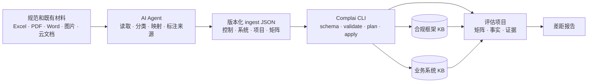

<div align="center" id="top">

# Complai

### 面向 AI Agent 的合规工程工具链

*把规范、系统材料、测评记录和证据，转化为可追溯的合规知识库、控制矩阵与差距报告。*

[English](README.en.md) | 简体中文

[](https://crates.io/crates/complai)
[](LICENSE)
[](https://www.rust-lang.org/)
[](https://github.com/adeptify/complai/commits/main)

[Quickstart](#quickstart-guide) · [工作原理](#工作原理) ·
[能力概览](#包含哪些能力) · [文档](#文档)

</div>

---

## Complai 是什么

Complai 是一套开源 Rust CLI + Agent Skill，面向合规准备、差距分析和证据管理。
它让 AI Agent 能够把分散在规范、备案材料、测评报告、Excel、PDF、云文档和截图
中的信息，整理成可复用、可校验、可追溯的合规上下文。

Complai 不是新的聊天界面，也不内置大模型。你继续使用现有 Agent 读取和理解材料；
Complai 负责稳定的数据模型、严格的写入边界、来源追踪和确定性的文件操作。

核心模型保持简单：

```text
一个项目 = 一个系统 × 一个合规框架 × 一次评估范围
```

系统架构、资产、数据流等事实可以跨项目复用；框架控制项可以跨系统复用；本次评估
的发现、矩阵结论、证据和报告则保留在项目内。

## 合规闭环：建模 · 灌库 · 评估 · 交付

- **建模：** 初始化合规框架、业务系统和完整控制矩阵。
- **灌库：** Agent 读取任意可访问的 Excel、PDF、Word、图片、飞书或腾讯文档，
  生成版本化 JSON bundle。
- **评估：** 对照控制要求、系统事实和证据，记录 `met`、`partial`、`gap` 或
  `na`，并补充缺口、负责人和整改信息。
- **交付：** 追溯每个判断的来源，登记证据，生成可复核的合规差距报告。

## 为什么使用 Complai

- **Agent-native：** 工作流随 CLI 内置并按需加载，指令始终与二进制版本一致。
- **输入格式不限：** 文档读取交给 Agent 和当前可用工具，不要求用户整理专用模板。
- **写入过程受控：** 所有批量写入必须经过 `schema → validate → plan → apply`。
- **来源可追溯：** 保存来源类型、文档引用、页码/工作表/区块定位、可选 SHA-256、
  文档日期、置信度和稳定 external key。
- **系统知识可复用：** 同一系统跨框架、跨年度评估时，无需重复维护架构和资产信息。
- **本地开放：** 知识库与项目状态以可检查、可迁移的本地文件保存，不隐藏在提示词
  或封闭平台中。

## 工作原理



Agent 可以针对不同来源选择最合适的读取能力；Complai 只接受符合当前 JSON Schema、
且目标系统、项目、框架和控制项均有效的结构化记录。

## Quickstart Guide

Complai 由 Agent 驱动：安装 CLI、安装轻量 discovery skill，然后直接描述你要完成
的合规任务。

### 1. 安装 CLI

需要 stable Rust 和 Cargo。当前功能基线是 Complai `0.3.0`：

```sh
cargo install complai --version 0.3.0 --locked
complai --version
```

如需使用尚未发布的仓库版本：

```sh
cargo install --git https://github.com/adeptify/complai --locked --force
complai --version
```

### 2. 安装 discovery skill

CLI 和 Agent Skill 分别分发。Node.js/npm 只用于安装 skill：

```sh
npx skills add adeptify/complai --skill complai
```

安装的是轻量入口，实际工作流随 CLI 分发并按需加载：

```sh
complai skill list
complai skill get project-init
```

### 3. 让 Agent 初始化评估项目

在准备创建项目的目录中打开 Agent，然后说：

> 使用 Complai 为“订单平台”创建等保 2.0 三级评估项目。系统 slug 使用
> `order-platform`，项目名使用 `order-platform-dengbao3`。

Agent 会加载 `project-init`，确认系统、框架、项目名和框架可选级别，然后执行：

```sh
complai compliance scaffold dengbao-2.0
complai system init order-platform --name "订单平台"
complai project init order-platform-dengbao3 \
  --system order-platform \
  --framework dengbao-2.0 \
  --level 3
```

### 4. 提供已有材料

把本地材料放到一个目录、直接附加给 Agent，或者提供 Agent 有权访问的云文档链接，
然后说：

> 把 `./materials` 中的规范、备案材料、测评报告、资产清单和架构文档导入当前
> Complai 项目。应用前先向我展示 ingest plan。

Agent 会加载 `doc-ingest`，使用合适的工具读取材料，生成
`tmp/complai-ingest.json`，并依次执行：

```sh
complai ingest schema
complai ingest validate --from tmp/complai-ingest.json
complai ingest plan --from tmp/complai-ingest.json
# 检查 plan 后才执行：
complai ingest apply --from tmp/complai-ingest.json
```

一个 bundle 可以同时包含四种记录：

| 记录类型 | 写入位置 | 常见来源 |
|---|---|---|
| `control_content` | 共享合规框架 KB | 有权使用的规范或控制指引 |
| `system_fact` | 共享业务系统 KB | 架构、资产、数据流、部署材料 |
| `project_fact` | 当前评估项目 | 发现、整改、例外、决策 |
| `matrix_assessment` | 当前控制矩阵 | 测评结论和缺口 |

导入 ISO、NIST、SOC 2、PCI DSS 等尚未入库的框架时，在 `control_content`
中同时提供 `title`、`domain` 和 `category`，Complai 会创建控制项并自动建立索引。

低置信度记录默认拒绝写入；只有用户复核确认后，才能使用
`--allow-low-confidence`。

### 5. 开展差距分析并生成报告

继续告诉 Agent：

> 逐控制项开展差距分析。只使用已导入事实和已登记证据，标出不确定判断，并生成
> 差距报告。

Agent 会加载 `gap-analysis`，按控制项读取最小必要上下文：

```sh
complai compliance show dengbao-2.0:8.1.4.1
complai system find --control dengbao-2.0:8.1.4.1
complai fact find --control dengbao-2.0:8.1.4.1
complai evidence find --control dengbao-2.0:8.1.4.1
complai matrix trace dengbao-2.0:8.1.4.1

complai evidence add mfa-login.png \
  --control dengbao-2.0:8.1.4.1 \
  --type screenshot
complai matrix link dengbao-2.0:8.1.4.1 --evidence EV-0001
complai matrix set dengbao-2.0:8.1.4.1 gap \
  --gap "运维登录未启用多因素认证" \
  --owner "安全负责人"

complai gen report
```

报告输出到项目内的 `drafts/compliance-report.md`。

## 包含哪些能力

| 能力 | 用途 | 主要命令 |
|---|---|---|
| 合规框架 KB | 共享控制项、要求摘要和实施指引 | `compliance scaffold/list/show/build` |
| 业务系统 KB | 复用架构、资产、数据流和策略事实 | `system init/add/find/show` |
| 统一 ingest | 严格、可追溯、幂等的 Agent 批量写入 | `ingest schema/validate/plan/apply` |
| 评估项目 | 绑定一个系统、框架和可选级别 | `project init/show` |
| 控制矩阵 | 状态、缺口、负责人、事实和证据引用 | `matrix show/set/link/trace` |
| 项目事实 | 发现、整改、例外、决策和备注 | `fact add/find/show` |
| 证据管理 | 复制、哈希、分类、查询并关联证据 | `evidence add/list/find/show` |
| 报告生成 | 生成当前合规差距报告 | `gen report` |

## 内置 Agent 工作流

| 工作流 | 适用任务 |
|---|---|
| `project-init` | 确认系统、框架和可选级别并初始化项目 |
| `doc-ingest` | 读取任意可访问来源并生成受控 ingest bundle |
| `gap-analysis` | 评估控制项、关联事实与证据并生成报告 |

通过当前安装的 CLI 发现和加载工作流：

```sh
complai skill list
complai skill get doc-ingest
```

分发与维护方式见 [skills/SKILLS.md](skills/SKILLS.md)。

## 存储模型

共享知识默认位于 `~/.complai/kb`：

```text
~/.complai/kb/
├── compliance/<framework>/
│   ├── index.yaml
│   ├── <framework-specific-path>/<control-id>.md
│   └── controls/<safe-control-id>.md
└── system/<slug>/
    ├── index.yaml
    └── <domain>/SYS-F-NNNN.md

<project>/
├── project.yaml
├── matrix.yaml
├── facts/
├── evidence.yaml
├── evidence/
└── drafts/
```

环境变量：

- `COMPLAI_KB_DIR`：覆盖共享知识库根目录。
- `COMPLAI_PROJECT_DIR`：当前目录不在项目内时，显式指定项目根。

字段模板与示例见 [docs/file-templates.md](docs/file-templates.md)。

## 当前范围与安全边界

- 内置 scaffolder 当前只支持等保 2.0 三级的 `dengbao-2.0`。
- 内置框架结构只包含控制 ID 和短标题，不包含标准原文。
- 控制内容必须来自用户有权使用的材料，并由 Agent 用自己的话概述。
- 云文档需要 Connector、开放 API、已登录浏览器或 Agent 可读取的导出文件。
- 测评报告中的 `matrix_assessment` 不能被当作权威规范内容。
- 缺失或不确定的信息必须保持 partial 或低置信度；Agent 不得臆造控制要求、
  系统事实、证据或评估结论。

## 开发

```sh
git clone https://github.com/adeptify/complai.git
cd complai

cargo build
cargo test
cargo clippy --all-targets -- -D warnings
cargo package --list --allow-dirty
```

项目使用 Rust 2024。修改 Agent Skill 分发时还应运行：

```sh
shellcheck scripts/check-agent-skills.sh
scripts/check-agent-skills.sh
```

<details>
<summary><strong>仓库结构</strong></summary>

```text
data/                         内置框架结构
schemas/                      版本化 Agent ingest schema
skills/complai/               可安装的 discovery skill
src/compliance/               共享合规框架知识库
src/system/                   共享业务系统知识库
src/project/                  评估工作区、矩阵、事实和证据
src/skills_content/           编译进 CLI 的工作流
tests/                        单元、集成和快照测试
```

</details>

## 文档

- [文件格式与初始化](docs/file-templates.md)
- [Agent Skill 架构](skills/SKILLS.md)
- [存储与设计计划](PLAN.md)
- [JSON ingest schema](schemas/ingest-v1.schema.json)

## License

MIT，详见 [LICENSE](LICENSE)。

---

<div align="center">

*一次构建合规上下文，在多次评估中持续复用。*

<p><a href="#top">⬆️ Back to top</a></p>

</div>
